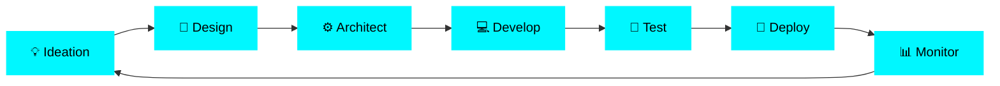

<div align="center">

# 『 YASIRU LAKSHAN RATHNAYAKA 』

```ascii
██╗   ██╗ █████╗ ███████╗██╗██████╗ ██╗   ██╗
╚██╗ ██╔╝██╔══██╗██╔════╝██║██╔══██╗██║   ██║
 ╚████╔╝ ███████║███████╗██║██████╔╝██║   ██║
  ╚██╔╝  ██╔══██║╚════██║██║██╔══██╗██║   ██║
   ██║   ██║  ██║███████║██║██║  ██║╚██████╔╝
   ╚═╝   ╚═╝  ╚═╝╚══════╝╚═╝╚═╝  ╚═╝ ╚═════╝ 
```

### ⚡ Digital Alchemist • Code Artisan • Experience Architect


```diff
+ Currently Architecting: AI-Powered Web Ecosystems
! Location: 🌴 Matara, Sri Lanka 🇱🇰
# Status: Building the Future, One Commit at a Time
```

</div>

---

<div align="center">

## 『 ⚡ THE ARSENAL ⚡ 』

</div>

<table align="center">
<tr>
<td width="50%" valign="top">

### 🎨 Frontend Sorcery
```yaml
frameworks:
  - React.js ⚛️
  - Next.js ▲
  - React Native 📱
  
styling:
  - TailwindCSS 🌊
  - Styled Components 💅
  - Framer Motion 🎭
  
state_management:
  - Redux Toolkit 🔄
  - Zustand 🐻
  - React Query 🔍
```

</td>
<td width="50%" valign="top">

### ⚙️ Backend Wizardry
```yaml
languages:
  - Java ☕
  - TypeScript 📘
  - Python 🐍
  
frameworks:
  - Spring Boot 🍃
  - Node.js + Express 🚂
  - FastAPI ⚡
  
security:
  - JWT Authentication 🔐
  - OAuth 2.0 🛡️
  - Spring Security 🔒
```

</td>
</tr>
<tr>
<td width="50%" valign="top">

### 🗄️ Data Engineering
```yaml
databases:
  - PostgreSQL 🐘
  - MongoDB 🍃
  - Redis ⚡
  
orm:
  - Hibernate 🌊
  - Prisma 🔷
  - Mongoose 🦫
```

</td>
<td width="50%" valign="top">

### ☁️ Cloud & DevOps
```yaml
platforms:
  - AWS ☁️
  - Vercel ▲
  - Render 🎨
  
tools:
  - Docker 🐳
  - GitHub Actions 🤖
  - Nginx 🌐
```

</td>
</tr>
</table>

---

<div align="center">

## 『 🧬 THE CODE PHILOSOPHY 』

</div>

<table align="center">
<tr>
<td align="center" width="25%">

### 🎯
**PRECISION**
```
Every pixel
matters
```

</td>
<td align="center" width="25%">

### ⚡
**PERFORMANCE**
```
Speed is not
a luxury
```

</td>
<td align="center" width="25%">

### 🧠
**INTUITION**
```
Design that
thinks ahead
```

</td>
<td align="center" width="25%">

### 🔧
**CRAFTSMANSHIP**
```
Clean code
clean mind
```

</td>
</tr>
</table>

---

<div align="center">

## 『 📊 BATTLE STATS 』


</div>

---

<div align="center">

## 『 🚀 CURRENT MISSIONS 』

</div>

```typescript
interface CurrentMissions {
  mission_001: {
    title: "🔐 Fortress Authentication",
    tech: ["Spring Boot", "JWT", "Redis"],
    status: "🟢 Active Development"
  },
  mission_002: {
    title: "🧠 AI Integration Matrix",
    tech: ["OpenAI API", "LangChain", "Vector DB"],
    status: "🟡 Research Phase"
  },
  mission_003: {
    title: "📱 Cross-Platform Domination",
    tech: ["React Native", "Expo", "TypeScript"],
    status: "🟢 Active Development"
  },
  mission_004: {
    title: "☁️ Cloud Architecture",
    tech: ["AWS", "Docker", "Kubernetes"],
    status: "🔵 Deployment Phase"
  }
}
```

---

<div align="center">

## 『 💎 SIGNATURE PROJECTS 』

</div>

<details>
<summary>🎯 <b>PROJECT ALPHA</b> - Next-Gen SaaS Platform</summary>

```javascript
const project = {
  name: "PROJECT ALPHA",
  description: "Enterprise-grade SaaS with AI capabilities",
  stack: {
    frontend: ["Next.js 14", "TypeScript", "TailwindCSS"],
    backend: ["Spring Boot", "PostgreSQL", "Redis"],
    deployment: ["AWS EC2", "RDS", "S3"]
  },
  features: [
    "🤖 AI-Powered Analytics",
    "🔐 Multi-tenant Architecture", 
    "⚡ Real-time Collaboration",
    "📊 Advanced Dashboard"
  ],
  impact: "10K+ Active Users | 99.9% Uptime"
}
```

**[View Project →](https://github.com/yasiruLakshan/project-alpha)**

</details>

<details>
<summary>🎯 <b>PROJECT NEXUS</b> - Mobile Experience Reimagined</summary>

```javascript
const project = {
  name: "PROJECT NEXUS",
  description: "Cross-platform mobile app with offline-first architecture",
  stack: {
    mobile: ["React Native", "Expo", "TypeScript"],
    backend: ["Node.js", "MongoDB", "Socket.io"],
    state: ["Zustand", "React Query"]
  },
  features: [
    "📱 Offline Mode",
    "🔔 Push Notifications",
    "🎨 Adaptive UI/UX",
    "⚡ Real-time Updates"
  ],
  impact: "50K+ Downloads | 4.8★ Rating"
}
```

**[View Project →](https://github.com/yasiruLakshan/project-nexus)**

</details>

<details>
<summary>🎯 <b>PROJECT ZENITH</b> - Design System & Component Library</summary>

```javascript
const project = {
  name: "PROJECT ZENITH",
  description: "Production-ready React component library",
  stack: {
    core: ["React", "TypeScript", "Styled Components"],
    tools: ["Storybook", "Jest", "Chromatic"],
    build: ["Rollup", "Babel", "ESLint"]
  },
  features: [
    "🎨 50+ Components",
    "♿ WCAG AAA Compliant",
    "📱 Responsive & Adaptive",
    "🌙 Dark Mode Support"
  ],
  impact: "NPM Package | 1K+ Weekly Downloads"
}
```

**[View Project →](https://github.com/yasiruLakshan/project-zenith)**

</details>

---

<div align="center">

## 『 🎨 CREATIVE PROCESS 』



</div>

---

<div align="center">

## 『 🌐 CONNECT WITH ME 』

[](https://yasirulakshan.dev)
[](https://linkedin.com/in/yasiruLakshan)
[](https://twitter.com/yasiruLakshan)
[](mailto:yasiru@example.com)

</div>

---

<div align="center">

### 『 💭 PHILOSOPHY 』

```typescript
const manifesto = {
  belief: "Code is poetry written in logic",
  approach: "Design with purpose, engineer with precision",
  mindset: "Every line of code is a brushstroke on the digital canvas",
  goal: "Transform imagination into interactive reality"
};
```

---


</div>
### 📊 Yasiru's Contribution Overview

[](https://github.com/YasiruLR)

[](https://github.com/YasiruLR)

[](https://git.io/streak-stats)

---

### 📈 Contribution Line Chart

[](https://github.com/YasiruLR)

---

## 🧰 Tech Stack


---

## 🌐 Connect With Me

<p align="center">
<a href="https://github.com/YasiruLR"></a>
<a href="https://www.linkedin.com/in/yasiru-lakshan/"></a>
<a href="mailto:yasirulakshanr@gmail.com"></a>
</p>

---

____Yasiru Lakshan Rathnayaka___


** Yasiru | Last Updated: 2025**


